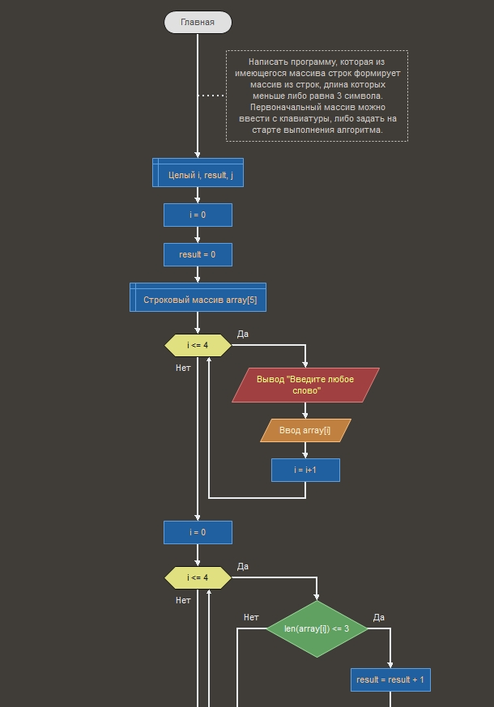
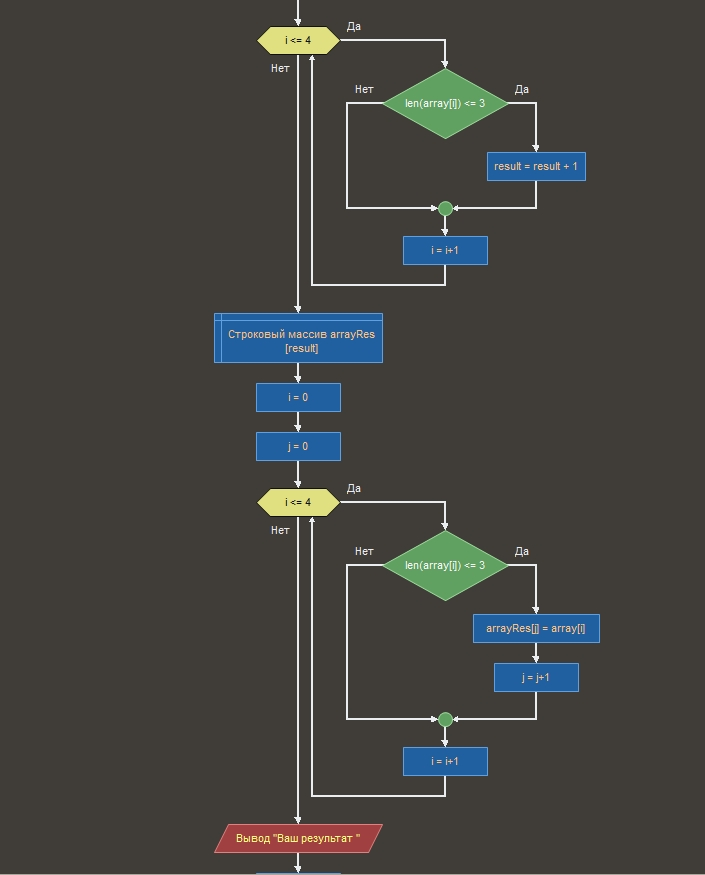
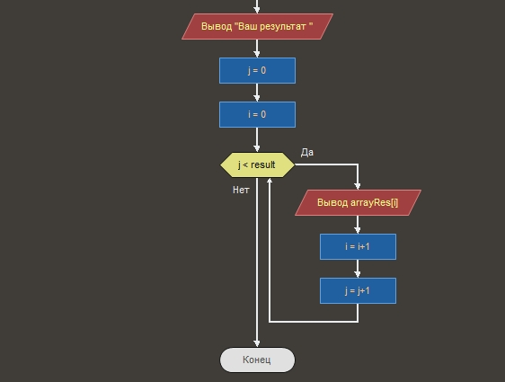

_26.03.2023 **Владислав Букреев г.Хабаровск**_
# Описание решения итоговой контрольной работы по первому блоку : Введение в программирование. 

## Добрый день уважаемый проверяющий!
Прикрепляю к репозиторию готовый работающий файл блок схемы в среде программирования "Flowgorithm". 
Так же далее вставлю несколько скрин-шотов этой блок схемы для удобного ознакомления.

## Задание
Написать программу, которая из имеющегося массива строк формирует массив из строк, длина которых меньше либо равна 3 символа. 
Первоначальный массив можно ввести с клавиатуры, либо задать на старте выполнения алгоритма.
При решении не рекомендуется пользоваться коллекциями, лучше обойтись исключительно массивами.

## Скрин шоты блок схемы.

+ Скрин №1.

1. Создаём переменную i , j , result. 
2. Присваиваем обоим значение - 0.
3. Создаём строковый массив из 5 элементов.
4. Используя цикл while заполняем массив строками с консоли, после каждого слова увеличиваем счётчик на 1.
5. Обнуляем счётчик i.
6. Снова с помощью цикла while выясняем сколько слов в нашем массиве с длиной <= 3. Сохраняем полученное значение в переменную result.

+ Скрин №2.

7. Создаём новый массив длиной с переменную result.
8. Обнуляем счётчики i, j.
9. С помощью цикла while смотрим на первый элемент изначального массива, если слово соответствует требованию - записываем его в новый массив. Если нет пропускаем.

+ Скрин №3.

10. Вывод результата с обнулением счётчика и снова с помощью цикла while.

# Описание решения КОД.
## Скрин шот КОДА.

Скажу сразу: 
+ При написании блок схемы в среде Flowgorithm код уже можно получить готовый. Но он весьма примитивный и не красивый. После прохождения первого курса у меня сложилось понимание как а главное почему важно писать универсальный код (Большое спасибо Сергею Камянецкому, особенно за его видео "Как начать в код: философия методов")
* Я не совсем понимаю зачем я тут это всё пишу , дз наверняка не проверят должным образом а мои старания никому вовсе и не нужны. Я всего лишь один из миллионов студентов, но , долой лирику.
+ Вообщем при написании кода я решил использовать алгоритм похожий на тот что в блок схеме, но модернизировать его , улучшить и сделать более красивым и универсальным

## ИТАК, КОД:
1. Очищаем консоль от мусора.
2. Просим пользователя ввести любые слова через пробел и считываем их в пременную типа string.
3. Создаём переменную типа int "size" значение которой будет являться метод, в котором мы ищем колличество слов нужных нам по длине. 
4. Далее в новом методе уже мы заполняем новый массив "ArrayRes" созданный размером size, словами длина которых <= 3 элементам.
5. Печаем новый отсортированный массив .